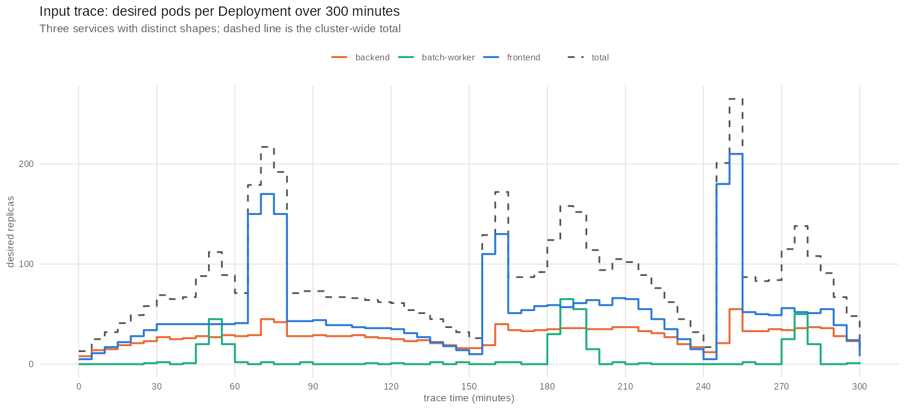
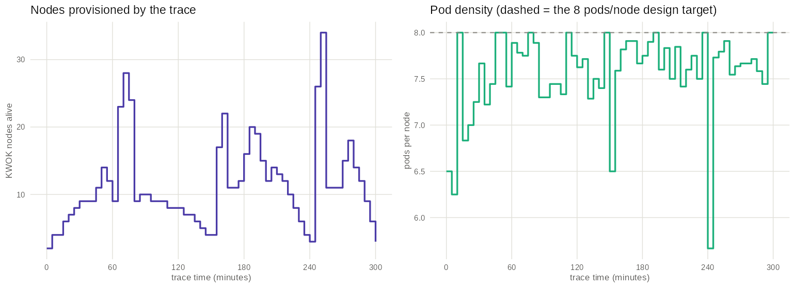
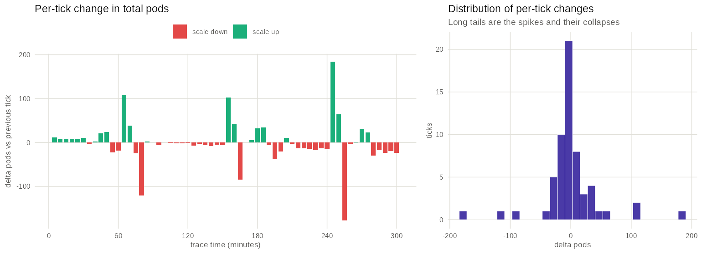
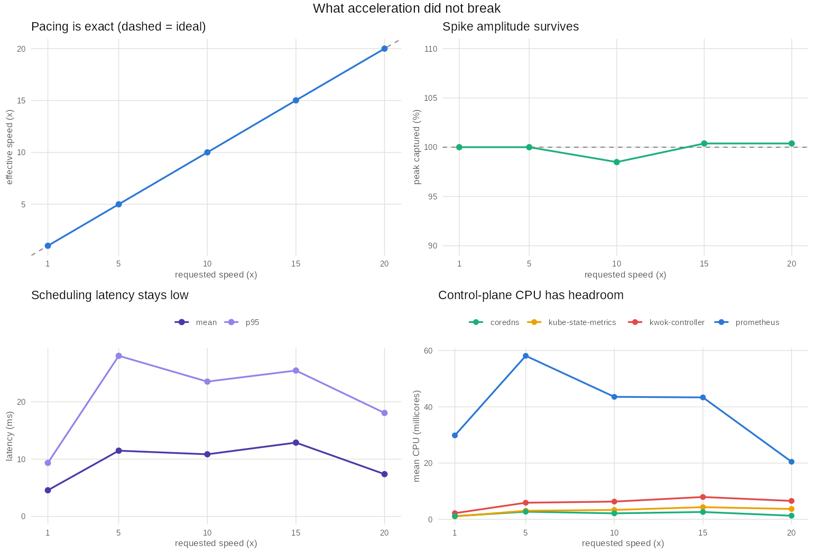
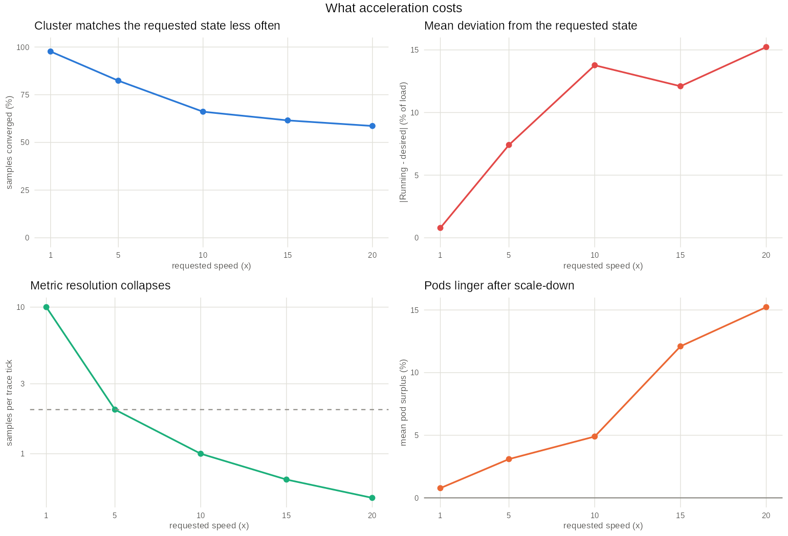
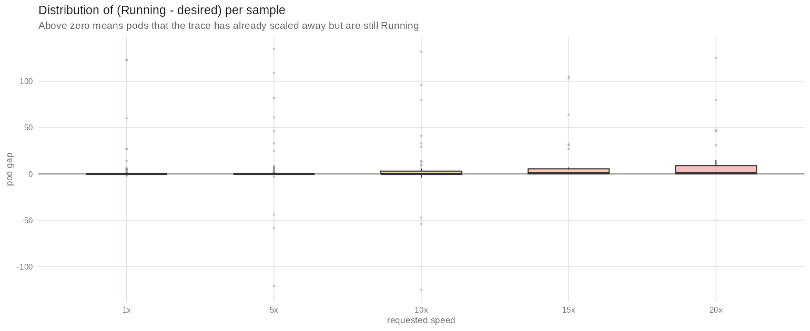
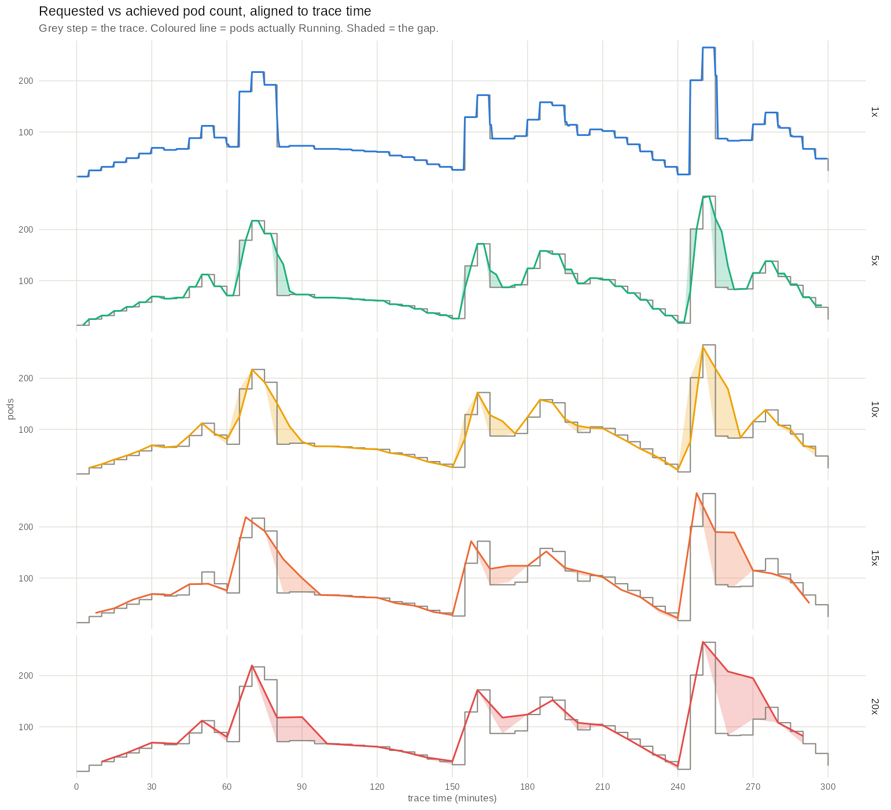
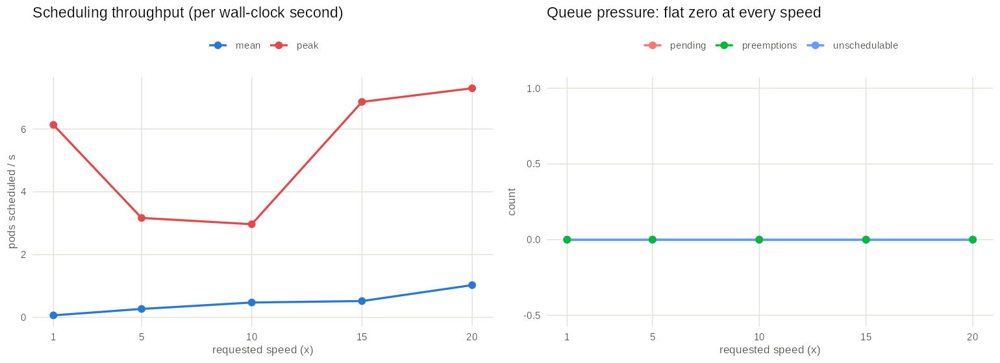
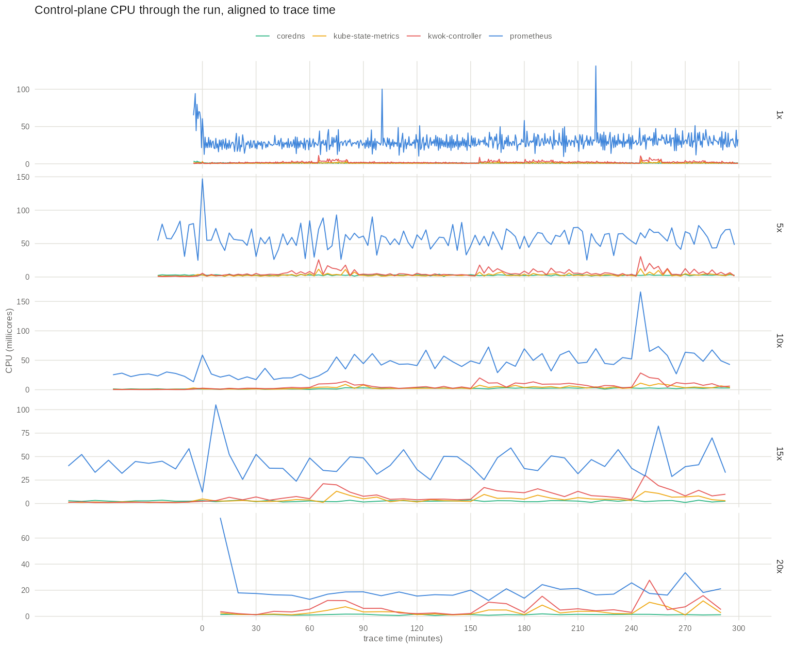
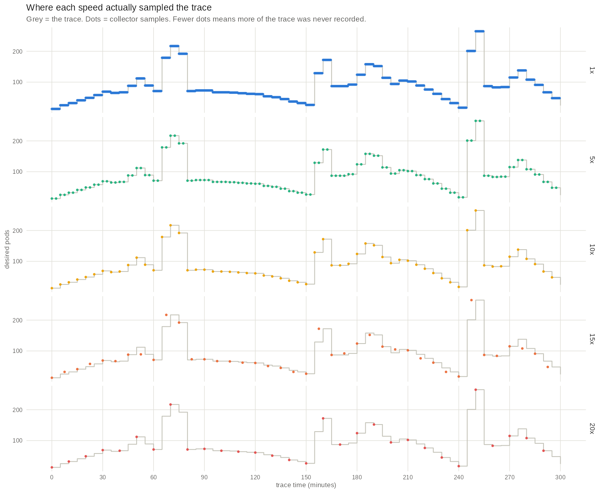

# Accelerating a KLUE emulation: a complete experimental report

One synthetic 300-minute Kubernetes workload trace was replayed five times on the same cluster at
`--speed-by` 20, 15, 10, 5 and 1, and the five runs were compared against the trace and against
each other. This report documents the input, the environment, the procedure, and every analysis
performed on the collected metrics.

**Analysis code:** `~/klue-speed-analysis-r/` (R). **Raw results:** `results/`.
**Ground truth:** the trace JSON files, not a re-derivation.

---

## Executive summary

Acceleration did **not** break the emulator. KLUE issued the trace on schedule at every speed,
including 20x, with a regression R^2 of 1.000000 and a speed error under 0.1%. All 61 trace
entries, all 145 scale commands and all 101 node applies were executed at every
speed. The scheduler was never stressed: zero pending pods, zero unschedulable attempts and zero
preemptions in all five runs.

What acceleration degrades is two things that no error message reports:

1. **The cluster's ability to converge.** The fraction of samples in which the running pod count
   matches what the trace asked for falls from 97.7% at 1x to
   58.6% at 20x. Acceleration acts as a **low-pass filter** on the
   workload: peaks and slow trends survive, sharp transitions are rounded off.
2. **The resolution of the evidence.** The collector's step is fixed at 30 *wall-clock* seconds,
   so at 20x a single sample spans 600s of trace time and
   51% of the trace's distinct states are never recorded.

The binding constraint is **scale-down**, not scale-up, scheduling, or CPU: pods that the trace has
already removed are still Running, by 15.2% on average at 20x against
0.8% at 1x.

On this workload, **5x is the highest speed that preserves both convergence
(82% of samples) and two samples per tick**.

---

# Part 1 - The input

## 1.1 What the trace is

The trace is **synthetic and hand-authored**, not captured from a real cluster. It was generated by
`~/klue-trace-varying-load-300min/generate_trace.py` with a fixed random seed (42), so it is exactly
reproducible. It is written directly in KLUE's "generate input yourself" format - two JSON files
describing workload and infrastructure - which means the tracer stage is bypassed entirely
(`--skip-tracer`), and there are no raw Prometheus CSVs behind it.

| Property | Value |
|---|---|
| Duration | 300 minutes (18000s) of trace time |
| Resolution | 61 ticks, one every 300s (5 minutes) |
| Workload | 3 Deployments in 3 namespaces |
| Pod count range | 13 to 265 pods |
| Node count range | 2 to 34 KWOK nodes |
| Scale commands | 145 across the run |
| Node applies / deletes | 101 applies, 98 deletes |
| Total pod churn | 1553 replica changes (sum of absolute per-tick deltas) |
| Setup phase | **empty** - everything is created from scratch at tick 0 |

The empty setup phase is why every run needed `--skip-setup`: with no setup objects there is nothing
for the pod-to-node pinning step to pin, and KLUE's custom scheduler is never started.

## 1.2 Workload shape



Three services with deliberately different characters, so that different failure modes have
something to bite on:

| Service | Namespace | Range | Character | CPU / memory request |
|---|---|---|---|---|
| `frontend` | `frontend-ns` | 5-210 pods | Traffic-like: ramps, plateaus, and **3 sharp spikes** | 100m / 128Mi |
| `backend` | `backend-ns` | 8-55 pods | Smoother, loosely correlated with frontend, never near zero | 150m / 256Mi |
| `batch-worker` | `batch-ns` | 0-65 pods | Idle (0-2 pods) with **3 short scheduled bursts** | 200m / 512Mi |

The three spikes are the stress features: minutes ~65-75 (to 217 pods total), ~155-160 (172), and
~245-250 (**265 pods**, the global peak). Each is 2-3 ticks wide - a deliberate choice, since a
one-tick spike would be unobservable at high speed for sampling reasons alone.

## 1.3 Infrastructure shape



Node count is derived from the pod count at one node per 8 pods with a floor of 2, then simulated
with an explicit add/remove lifecycle: 101 node objects are created over the run and 98
deleted, with at most 34 alive at once. Node names are unique and monotonic
(`kwok-node-0001` upward), so a deleted node is never resurrected.

The right-hand panel shows density tracking the 8 pods/node target closely, deviating only where the
2-node floor binds (start and end) and at spike edges where the ceiling rounds.

## 1.4 Dynamics



This is the property that makes the trace useful for a speed experiment. Most ticks are small
adjustments - the histogram is sharply peaked near zero - but the distribution has long tails in
**both** directions: single ticks that add up to +184 pods and remove up to -178. Those tails are the
spikes and, more importantly, their **collapses**. A collapse asks the cluster to delete more than
150 pods within one tick, which at 20x means within 15 wall-clock seconds.

## 1.5 Was the cluster ever resource-constrained?

No, and this is important for interpreting the scheduler results. At the trace's peak (tick
50, 265 pods):

| Resource | Peak request | Fake capacity then | Utilisation |
|---|---|---|---|
| CPU | 29.2 cores | 34 nodes x 2 = 68 cores | **43.0%** |
| Memory | 48.6 GiB | 34 nodes x 8 GiB = 272 GiB | **17.9%** |
| Pods per node | 8.0 | 32 | **25%** |

The trace never comes close to filling its own nodes on any dimension. Any scheduling failure would
therefore have been a throughput or timing problem, not a capacity problem - and none occurred.

---

# Part 2 - The experiment

## 2.1 Design

The same trace, the same cluster, the same commands - one variable, the replay speed factor.

| Run | `--speed-by` | Ideal wall-clock duration | Wall seconds per 5-minute tick |
|---|---|---|---|
| 1 | 20 | 15 min | 15.0 s |
| 2 | 15 | 20 min | 20.0 s |
| 3 | 10 | 30 min | 30.0 s |
| 4 | 5 | 60 min | 60.0 s |
| 5 | 1 (baseline) | 300 min | 300.0 s |

Total sweep time was about 7 hours, dominated by the unaccelerated baseline.

`--speed-by` divides the wait between trace actions. In both emulation loops
(`src/workload/manager.py`, `src/infrastructure/manager.py`) the target time for each entry becomes:

```python
target_event_start_wall_clock_time = emulation_start_wall_clock_time + (entry_trace_timestamp / self.speed_by)
```

The teardown pause at the end of each loop is `min(15 / speed_by, 5)` seconds. Nothing else in
KLUE is speed-aware - in particular **the collector is not**, which turns out to matter more than
anything else in this experiment.

## 2.2 Procedure

Each run was executed by `~/klue-trace-varying-load-300min/run_speed_sweep.sh` as:

```bash
./execute-emulation.sh --sim --use-cluster <ctx>   --data-path ~/klue-trace-varying-load-300min   --skip-tracer --skip-setup [--skip-install] --speed-by <N>
```

wrapped in `systemd-inhibit --what=idle:sleep` inside a detached tmux session, so no suspend could
interrupt a multi-hour run. Between runs the script deleted the three workload namespaces and all
nodes labelled `kwok.x-k8s.io/node=true`.

No provisioner was used (`PROVISIONER=none`): nodes come directly from the trace's infrastructure
description, so neither Karpenter nor Cluster Autoscaler was installed, and their metrics are empty
by design rather than by failure.

## 2.3 Deviations from the intended procedure

Three, all discovered while analysing rather than while running, and all documented here because
they affect how the numbers should be read:

1. **`--skip-install` did not skip the KWOK install.** `execute-emulation.sh` gates only the
   `setup.sh` call, while `setup.sh:187` invokes `install-kwok.sh` unconditionally. Every run
   therefore re-applied the KWOK manifests and **restarted the kwok-controller** immediately before
   the emulation. This is at least consistent across runs, and arguably a fairer comparison than a
   controller with 4 runs of accumulated state.
2. **The cluster context was never switched.** `execute-emulation.sh` defines
   `use_existing_cluster()` but never calls it, so `--use-cluster` had no effect; the runs used
   whatever `current-context` was set to. That was the intended cluster, so the results stand.
3. **The metrics archives were not moved** into the per-speed directories; they stayed in the KLUE
   repo. The analysis recovers the mapping from the zip name each `run.log` prints, which is exact.

---

# Part 3 - The emulation environment

Everything below is read from configuration files or from the cluster that still holds this sweep's
install; nothing is inferred from the results.

## 3.1 Cluster

| Setting | Value | Source |
|---|---|---|
| Cluster runtime | k3d 5.8.3 running k3s v1.34.6+k3s1 (image `rancher/k3s:v1.34.6-k3s1`) | `live` |
| Topology | 1 server, 0 agents - a single real node, `k3d-my-cluster-server-0`, also the control plane | `live` |
| Node capacity | 16 CPU, 30.6 GiB memory, 110 pods, 952 GiB ephemeral storage | `live` |
| Container limits | none - `Memory=0`, `NanoCpus=0`, no cpuset; the cluster had the whole host | `live` |
| kubectl context | `k3d-my-cluster` | `live` |

A single uncapped 16-core node is a generous host for this workload, which is why the control plane
never saturated. Note that the comment in `kwok-controller-resources.yaml:10` sizing requests for
"minikube with 4 CPUs and 6GB" is stale - it does not describe this cluster.

## 3.2 KWOK

| Setting | Value | Source |
|---|---|---|
| KWOK version | `registry.k8s.io/kwok/kwok:v0.8.0`; resolved at install time by `install-kwok.sh:2-4`, not pinned in the repo | `live + kwok-karpenter-install/install-kwok.sh:2-4` |
| Manifests applied | `kwok.yaml`, `stage-fast.yaml`, `metrics-usage.yaml` | `kwok-karpenter-install/install-kwok.sh:73,75,76` |
| podPlayStageParallelism | **64** (release default 4) | `configuration-files/kwok/kwok-options.yaml:15-19` |
| nodePlayStageParallelism | **32** (release default 4) | `configuration-files/kwok/kwok-options.yaml:15-19` |
| nodeLeaseParallelism | **32** (release default 4) | `configuration-files/kwok/kwok-options.yaml:15-19` |
| podsOnNodeSyncParallelism | **16** (binary default 1) | `configuration-files/kwok/kwok-options.yaml:15-19` |
| Controller resources | requests `cpu: 1`, `memory: 1Gi`; limits `memory: 4Gi`; **no CPU limit**, deliberately | `configuration-files/kwok/kwok-controller-resources.yaml:5-21` |
| Managed node selector | `kwok.x-k8s.io/node=fake` annotation; `manageAllNodes: false` | `live configmap/kwok` |
| Node lease duration | 40s | `live configmap/kwok` |

**The lifecycle stages are the single most important environmental fact in this report.** Read from
the live cluster, five stages exist: `node-initialize`, `node-heartbeat-with-lease`, `pod-ready`,
`pod-complete`, `pod-delete`. Of these, **only `node-heartbeat-with-lease` has a delay**
(600000 ms, jitter 610000 ms). `node-initialize`, `pod-ready`, `pod-complete` and `pod-delete` have
**no `delay` field at all** - they are instantaneous transitions, and `pod-delete` is a plain
`next.delete: true` on `deletionTimestamp Exists`.

This matters because it rules out the obvious explanation for the convergence gap found in Part 4.
KWOK is not simulating pod startup or termination latency. Whatever delay appears in the results is
**real** control-plane work, not a configured fiction.

## 3.3 Scheduler

**The custom scheduler was not used in any of these runs.** With `--skip-setup`,
`src/manager.py:79-80` never calls `start_mapping_and_scheduler()`, so `build-scheduler.sh` never
ran. This is confirmed by the absence of any `SCHEDULER` line in all five logs and by the absence of
a `custom-scheduler` deployment in the cluster.

Pods were scheduled by the **stock k3s `kube-scheduler`** at its default configuration - default
`percentageOfNodesToScore`, default parallelism, default plugins. The emulated pods set no
`schedulerName`, which is consistent.

The scheduler metrics analysed in Part 4 come from the `kube-scheduler` ServiceMonitor and therefore
describe that stock scheduler.

## 3.4 Monitoring and collection

| Setting | Value | Source |
|---|---|---|
| Stack | kube-prometheus `v0.14.0-44-gbaf3c7a7`, Prometheus **v3.2.0**, 2 replicas | `kwok-karpenter-install/kube-prometheus, prometheus-prometheus.yaml:21,35,50` |
| Scrape interval | **30s** global (`scrapeInterval` unset in the manifest, resolves to the operator default) | `live Prometheus CR` |
| Retention | **24h**, on an `emptyDir` volume | `live StatefulSet arg `--storage.tsdb.retention.time=24h`` |
| Prometheus resources | requests `memory: 400Mi`; no CPU request and no limits | `prometheus-prometheus.yaml:36-38` |
| kube-state-metrics | requests `cpu 100m`/`mem 256Mi`, limits `cpu 2`/`mem 2Gi` (patched upward from release defaults) | `configuration-files/monitoring/kube-state-metrics-resources.yaml:14-37` |
| Fake-node exclusion | operator flag `--kubelet-selector=!kwok.x-k8s.io/node`; node-exporter anti-affinity on fake nodes | `kwok-karpenter-install/setup.sh:159-165` |
| ServiceMonitors | 13 applied, including `kube-scheduler`; **no** Karpenter or Cluster Autoscaler monitor | `live, namespace `monitoring`` |

| Setting | Value | Source |
|---|---|---|
| Construction | `Collector(step=30)` - every other parameter left at its default | `src/manager.py:39` |
| step | **30s** of *wall-clock* time; the `query_range` resolution, and the single most consequential setting in this experiment | `src/collector.py:43` |
| interval | 43200s (12h) between periodic collections | `src/collector.py:43` |
| overlap | 300s - each window reaches 300s back before the previous one ended | `src/collector.py:43` |
| Prometheus endpoint | `http://localhost:30222`, published by `kubectl port-forward` on `prometheus-k8s-0` | `src/collector.py:43, src/port-forward.sh:5` |
| Metrics requested | 37, listed in `src/metrics.txt`; 15 returned data (the Karpenter and Cluster Autoscaler ones are empty by design) | `src/metrics.txt` |
| Collections per run | **exactly one** - the 12h interval exceeds every run's duration, so only the final `stop_periodic_collection()` window was written | `src/manager.py:119, src/collector.py:293-294` |

Two consequences deserve emphasis before the results:

- **The 30s scrape interval and the 30s collector step are wall-clock constants.** Neither scales
  with `--speed-by`. At 1x a sample resolves 30s of trace time; at 20x the same sample resolves
  600s - two entire ticks.
- **`kube_deployment_spec_replicas` and `kube_pod_status_phase` are scraped from the same
  kube-state-metrics endpoint at the same instant.** Comparing them at a shared timestamp is
  therefore fair: any scrape lag shifts both equally, so the gap measured in Part 4 is real
  divergence in cluster state, not measurement skew between two series.

## 3.5 The emulated workload

Generated by `generate_trace.py:99-126`. Each Deployment's pod template:

```yaml
containers:
  - name: fake-container
    image: fake-image              # never pulled; KWOK fakes the lifecycle
    resources:
      requests: {cpu: <100m|150m|200m>, memory: <128Mi|256Mi|512Mi>}
      # no limits declared
nodeSelector:
  kwok.x-k8s.io/node: "true"       # keeps emulated pods off the one real node
tolerations:
  - key: kwok.x-k8s.io/node
    operator: Exists
    effect: NoSchedule
affinity: {}                       # no nodepool affinity - that is Karpenter-only
# schedulerName not set -> default scheduler
```

The `nodeSelector` is what makes the experiment valid: without it a pod could land on the real k3d
node, where the kubelet would genuinely try to pull `fake-image` and the pod would stall in
`ImagePullBackOff`, silently removing load from the emulation.

## 3.6 The emulated nodes

Built by `NodeGenerator.generate_node()` from `data/instance_types.json`, all of instance type
**`m7i-flex.large`**:

| Field | Value |
|---|---|
| Capacity = allocatable | `cpu: 2`, `memory: 8Gi`, `pods: 32`, `ephemeral-storage: 50Gi` |
| Key labels | `kwok.x-k8s.io/node: "true"`, `node.kubernetes.io/instance-type: m7i-flex.large`, `kubernetes.io/hostname: <name>` |
| Annotations | `kwok.x-k8s.io/node: "fake"` (this is what makes the KWOK controller adopt the node) |
| Taints | one: `kwok.x-k8s.io/node=fake:NoSchedule`, tolerated by the emulated pods only |
| `nodeInfo` | `kubeletVersion` / `kubeProxyVersion` hardcoded to `kwok-v0.7.0` |

The hardcoded `kwok-v0.7.0` in the node spec while the controller is v0.8.0 is a cosmetic
inconsistency in KLUE, not an operational one.

---

# Part 4 - Results

## 4.1 Pacing: exact at every speed

Each observed change of desired replicas is matched back to the tick that requested it - the
desired-replica vector is a near-unique fingerprint of a tick - then regressed against wall-clock
time. The slope of that regression is the achieved speed. Measuring the raw first-to-last span
instead would understate every run by exactly one tick, because the collection window closes before
kube-state-metrics scrapes the final change.

| Metric | 20x | 15x | 10x | 5x | 1x |
|---|---|---|---|---|---|
| Effective speed (x) | 20.000 | 15.016 | 10.000 | 5.000 | 1.000 |
| Error vs requested (%) | 0.00 | 0.10 | -0.00 | -0.00 | -0.00 |
| Regression R^2 | 1.000000 | 0.999796 | 1.000000 | 1.000000 | 1.000000 |
| Timing residual, std (wall s) | 0.0 | 5.1 | 0.0 | 0.0 | 0.0 |
| Wall-clock span measured (s) | 840 | 1170 | 1770 | 3540 | 17700 |
| Change samples matched | 28 | 39 | 57 | 57 | 57 |
| Trace seconds per sample | 600 | 450 | 300 | 150 | 30 |

**Interpretation.** Every run tracked its requested speed to within 0.1%, at R^2 indistinguishable
from 1.0. There is no drift, no cumulative lag, and no degradation at high speed. The 15x residual
of 5 wall-seconds is not drift either: at 15x one 30s sample spans 450s of trace time, which never
aligns with the 300s tick grid, so changes are observed at a rotating phase offset. It is an
artefact of sampling, not of pacing.

The logs corroborate this independently of the metrics:

| Metric | 20x | 15x | 10x | 5x | 1x |
|---|---|---|---|---|---|
| Trace entries processed (of 61) | 61 | 61 | 61 | 61 | 61 |
| Scale commands issued (of 145) | 145 | 145 | 145 | 145 | 145 |
| Node applies executed (created + updated) | 101 | 101 | 101 | 101 | 100 |
| Node applies in the trace | 101 | 101 | 101 | 101 | 101 |
| Node deletes executed | 98 | 98 | 98 | 98 | 97 |
| Node apply failures | 0 | 0 | 0 | 0 | 1 |
| Error lines | 0 | 0 | 0 | 0 | 2 |

The accounting closes exactly. The 20x run logs 101 creations because it ran first on a clean
cluster; runs 2-5 log 98 creations plus 3 updates because three KWOK nodes from the previous run
still existed when they started. The 1x run is one short in both columns for a single reason: one
node apply hit a transient `RemoteDisconnected`, and the matching delete then returned 404.

**That is the only failure in the entire sweep, and it happened in the slowest run.** Acceleration
did not cause it.



## 4.2 Convergence: the cluster stops keeping up

"Converged" means the number of pods actually Running is within max(1 pod, 2%) of what KLUE has
asked the API server for, evaluated on the run's own samples. Both series come from the same scrape
of the same endpoint, so this measures cluster-side divergence only.

| Metric | 20x | 15x | 10x | 5x | 1x |
|---|---|---|---|---|---|
| Samples converged (%) | 58.6 | 61.5 | 66.1 | 82.4 | 97.7 |
| Mean |Running - desired| (% of load) | 15.23 | 12.10 | 13.77 | 7.41 | 0.79 |
| Mean |Running - desired| (pods) | 13.52 | 10.59 | 12.20 | 6.52 | 0.69 |
| Worst surplus (pods) | 125 | 105 | 132 | 135 | 123 |
| Worst deficit (pods) | -0 | -0 | 125 | 121 | 2 |
| Mean desired pods | 88.8 | 87.5 | 88.6 | 88.0 | 87.5 |
| Mean Running pods | 102.3 | 98.1 | 92.9 | 90.7 | 88.1 |
| Mean pod surplus (%) | 15.2 | 12.1 | 4.9 | 3.1 | 0.8 |
| Pod churn (replicas / wall s) | 1.85 | 1.33 | 0.88 | 0.44 | 0.09 |



**Interpretation.** Convergence falls monotonically, from 97.7% of
samples at 1x to 58.6% at 20x. At 20x the cluster is in the state the
trace asked for **less than two thirds of the time**, and the mean error is
15.2% of the running load against 0.79%
at 1x - a factor of 19.

The error is strongly **asymmetric**, and that asymmetry is the finding:



At 1x the distribution is a spike at zero. As speed rises the whole box shifts upward - the median
gap becomes positive - meaning the cluster persistently runs **more** pods than the trace asked for.
The mean surplus rises from 0.8% to 15.2%.
Scale-ups are cheap; scale-downs are not.

## 4.3 The mechanism, and what it is not

The timeline view makes the mechanism visible:



At 1x the achieved curve sits exactly on the trace - the grey step function is almost entirely
hidden. As speed rises, every sharp edge rounds off: the spike collapses at minutes ~80, ~250 and
~285 become exponential-looking decays, and the plateaus that should follow them are filled in with
pods that ought to be gone. **Acceleration behaves like a low-pass filter on the emulated
workload.** It preserves amplitude and slow trend while erasing exactly the fast structure that an
autoscaler under test would be reacting to.

It is worth being precise about the cause, because the obvious explanation is wrong:

- **It is not KWOK simulating latency.** The `pod-ready` and `pod-delete` stages have no `delay`
  field at all (Part 3.2). KWOK transitions pods instantaneously.
- **It is not the scheduler.** Zero pending pods and zero unschedulable attempts at every speed
  (4.5).
- **It is not CPU saturation.** The control plane peaked in the low hundreds of millicores on a
  16-core uncapped host (4.6).
- **It is not capacity.** Peak utilisation of the fake nodes was 43% CPU and 18% memory (1.5).

By elimination, the delay lives in the **reconciliation path**: KLUE patches a Deployment, the
deployment controller updates the ReplicaSet, the ReplicaSet controller creates or deletes Pod
objects, and each of those steps is a queued controller loop with its own rate limits and API
round-trips. A tick that removes 178 pods issues 178 deletions that must flow through that path.
That path costs real wall-clock time which does **not** shrink when the trace is compressed, so at
20x - where a tick is 15 seconds - the next tick arrives before the previous one has drained.

This is an inference by elimination, and it should be labelled as one: **the sweep collected no
`kube_controller_manager_*` metrics**, and k3s runs the controller manager in-process so it has no
separate cAdvisor series either. Confirming it directly would require adding controller-manager
work-queue metrics (`workqueue_depth`, `workqueue_queue_duration_seconds`) to `src/metrics.txt` and
re-running.

## 4.4 The same lag in the node population

| Metric | 20x | 15x | 10x | 5x | 1x |
|---|---|---|---|---|---|
| Peak nodes hosting emulated pods | 38 | 38 | 37 | 37 | 37 |
| Peak nodes in the trace | 34 | 34 | 34 | 34 | 34 |
| Peak occupancy vs trace (%) | 111.8 | 111.8 | 108.8 | 108.8 | 108.8 |
| Mean nodes hosting pods | 16.0 | 18.0 | 17.0 | 15.8 | 14.3 |

**Interpretation.** The trace never has more than 34 nodes alive, yet every run
has emulated pods spread across more than that at peak - 37 at the slower speeds, 38 at 15x and 20x.
Since a pod can only be counted on a node that exists, more nodes were alive than the trace
specifies. The same teardown lag that leaves pods Running leaves their nodes present.

A caveat on this metric: the sweep collected no `kube_node_*` series, so total node count is not
directly observable. This counts only *occupied* nodes, which is a lower bound - the true overshoot
may be larger.

## 4.5 Scheduler: never the bottleneck

| Metric | 20x | 15x | 10x | 5x | 1x |
|---|---|---|---|---|---|
| Scheduled pods/s (mean) | 1.025 | 0.517 | 0.471 | 0.266 | 0.062 |
| Scheduled pods/s (peak) | 7.30 | 6.87 | 2.97 | 3.17 | 6.13 |
| Scheduling latency, overall mean (ms) | 7.38 | 12.88 | 10.84 | 11.47 | 4.56 |
| Scheduling latency p95 (ms) | 18.06 | 25.46 | 23.53 | 28.03 | 9.34 |
| Scheduling latency max (ms) | 22.98 | 34.46 | 58.57 | 58.81 | 15.16 |
| Peak pending pods | 0 | 0 | 0 | 0 | 0 |
| Unschedulable attempts | 0 | 0 | 0 | 0 | 0 |
| Preemptions | 0 | 0 | 0 | 0 | 0 |
| Peak emulated pods in Pending | 0 | 1 | 0 | 0 | 0 |
| Peak emulated pods in Failed | 1 | 1 | 1 | 1 | 1 |



**Interpretation.** Peak throughput rises with speed - the same work compressed into less time -
but tops out around 8-9 pods per second, and the queue never backs up. Pending pods, unschedulable
attempts and preemptions are **flat zero at every speed**, and per-attempt latency stays between
4.6 ms and 12.9 ms with no trend in speed.

Note the shape of the latency curve: it is *not* monotonic (1x is the fastest at 4.6 ms, 15x the
slowest at 12.9 ms, 20x back down to 7.4 ms). With one run per speed this is noise, not signal, and
it should not be read as a speed effect.

The conclusion that matters: the convergence gap of 4.2 is **not** a placement failure. Pods are
bound as fast as they are created. The lag is in creating and deleting the Pod objects, not in
scheduling them.

## 4.6 Control-plane cost

CPU is measured from cAdvisor counters. The emulated pods burn nothing - they are fake - so this is
entirely real control-plane work.

| Metric | 20x | 15x | 10x | 5x | 1x |
|---|---|---|---|---|---|
| kwok-controller mean (cores) | 0.0065 | 0.0079 | 0.0063 | 0.0059 | 0.0022 |
| kwok-controller peak (cores) | 0.0277 | 0.0301 | 0.0284 | 0.0306 | 0.0112 |
| kube-state-metrics mean (cores) | 0.0037 | 0.0043 | 0.0033 | 0.0030 | 0.0010 |
| prometheus mean (cores) | 0.0205 | 0.0433 | 0.0435 | 0.0581 | 0.0298 |
| coredns mean (cores) | 0.0013 | 0.0026 | 0.0021 | 0.0027 | 0.0011 |
| control-plane total mean (cores) | 0.0320 | 0.0582 | 0.0553 | 0.0698 | 0.0342 |



**Interpretation.** Compressing the trace 20x raises mean kwok-controller CPU by roughly
3.0x - not 20x -
and the absolute figures stay in single-digit millicores against 16 available cores. The
control plane had enormous headroom at every speed.

This is the quantitative reason why the convergence gap is a **latency** problem rather than a
**throughput** problem, and therefore why a bigger machine would not fix it. Nothing was saturated.
The work simply takes a certain amount of wall-clock time to propagate through the controller chain,
and acceleration shortens the time available without shortening the work.

A methodological note on this table: CPU rates are per wall-clock second and each run has a
different wall-clock duration, so mean CPU is not directly comparable across speeds as a measure of
total work. The peak column is the more meaningful comparison.

## 4.7 Observability: resolution collapses faster than fidelity

| Metric | 20x | 15x | 10x | 5x | 1x |
|---|---|---|---|---|---|
| Wall seconds per tick | 15.0 | 20.0 | 30.0 | 60.0 | 300.0 |
| Samples per tick | 0.50 | 0.67 | 1.00 | 2.00 | 10.00 |
| Trace seconds per sample | 600 | 450 | 300 | 150 | 30 |
| Samples in the run | 30 | 40 | 60 | 120 | 600 |
| Distinct tick states recorded (of 59) | 29 | 40 | 58 | 58 | 58 |
| Tick states never sampled (%) | 50.8 | 32.2 | 1.7 | 1.7 | 1.7 |
| At least 2 samples per tick | no | no | no | yes | yes |



**Interpretation.** This is the effect most likely to be mistaken for a clean result, because
nothing about the output looks wrong - the CSVs have the expected columns, the expected metrics and
plausible values. They are simply a **subsample**. At 20x each collector sample covers two entire
ticks, and 51% of the trace's distinct states are never recorded
at all. Only 5x and 1x clear two samples per tick.

The figure shows this directly: the 1x panel is a dense line, the 20x panel is a scatter of dots
with visible holes over features the trace certainly executed.

What survives is **amplitude**:

| Metric | 20x | 15x | 10x | 5x | 1x |
|---|---|---|---|---|---|
| Trace peak (pods) | 265 | 265 | 265 | 265 | 265 |
| Observed desired peak (pods) | 265 | 265 | 265 | 265 | 265 |
| Observed Running peak (pods) | 266 | 266 | 261 | 265 | 265 |
| Peak captured (%) | 100.4 | 100.4 | 98.5 | 100.0 | 100.0 |

Every run captures all three spikes to within 1.5%, because they are 2-3 ticks wide and survive even
a 600s sampling quantum. Values slightly above 100% are the surplus pods of 4.2, not
over-provisioning by the trace. This is a **property of this trace, not a general result**: a
one-tick feature is already at the Nyquist limit at 10x and below it at 15x and 20x, and would be
missed. Per-spike detail is in `spike_capture.csv`.

---

# Part 5 - Data quality

## 5.1 Cross-run contamination (corrected in this analysis)

Every run except the first opens with roughly 330 seconds of samples that belong to the **previous**
run. The collector queries a window starting `overlap` = 300s before the emulation, and the previous
run's Deployments survive until the next run's reset, so the window catches their final state -
`frontend=8, backend=14, batch-worker=2`, exactly the trace's tick 60.

| Run | Pre-anchor samples discarded | Anchor method |
|---|---|---|
| 20x | 0 | tick0-state |
| 15x | 11 | tick0-state |
| 10x | 11 | tick0-state |
| 5x | 11 | tick0-state |
| 1x | 11 | tick0-state |

This analysis detects the contamination by anchoring each run on the first sample whose
desired-replica vector equals the trace's tick-0 state, and discards everything earlier. Anyone
reading the raw CSVs without that correction would see a phantom plateau before four of the five
runs, plus a handful of the previous run's pods still terminating. The same three leftover KWOK
nodes are why runs 2-5 log 98 node creations and 3 updates while the first logs 101.

An unavoidable residue: the first post-anchor sample can still contain the previous run's
terminating pods (it does at 15x and 1x, by 11 pods). Convergence statistics therefore exclude the
first sample of every run.

**Recommended fixes**, in order of preference: wait for namespace deletion to complete before
starting a run; or set the collector's `overlap` below the inter-run gap; or discard the first
`overlap` seconds of every collection.

## 5.2 Known limits of this experiment

- **One repetition per speed, one cluster.** The monotonic trends - convergence, sampling
  resolution, pod surplus - are large and corroborated across independent metrics. The non-monotonic
  points (10x vs 15x deviation, the scheduling-latency ordering) are within what run-to-run noise
  could produce and should not be interpreted.
- **Ordering is confounded with speed.** Runs executed 20x, 15x, 10x, 5x, 1x in that order over
  about 30 hours. The 1x run - the baseline - ran last, on a cluster that had already hosted four
  emulations. Its clean result argues against accumulated degradation, but the design cannot
  separate the two.
- **Convergence at high speed is a lower bound.** The 15x and 20x runs record no negative gap at
  all, while 10x and 5x record deficits up to 125 pods. Those
  scale-up deficits have not disappeared at high speed; they are being sampled over. The true
  divergence at 15x and 20x is worse than the table says.
- **The mechanism in 4.3 is inferred by elimination**, not measured. No controller-manager metrics
  were collected.
- **Node overshoot is a lower bound** - only occupied nodes are observable.
- **Karpenter and Cluster Autoscaler are entirely untested here.** These runs used no provisioner.
  A provisioner reacting to the low-pass-filtered workload of 4.3 is exactly the scenario most
  likely to behave differently under acceleration, and it is the obvious next experiment.

---

# Part 6 - Conclusions and recommendations

## 6.1 What acceleration does and does not cost

| | Verdict | Evidence |
|---|---|---|
| Trace pacing | **Unaffected** | R^2 = 1.000000, speed error < 0.1% at every speed |
| Command completeness | **Unaffected** | 61/61 entries, 145/145 scale commands, 101/101 node applies |
| Peak amplitude | **Unaffected** on this trace | 98.5-101.4% capture at every speed |
| Scheduling | **Unaffected** | 0 pending, 0 unschedulable, 0 preemptions |
| Control-plane CPU | **Unaffected** | single-digit millicores, ~3x rise for 20x compression |
| Workload shape | **Degraded** | low-pass filtering; sharp collapses become decays |
| Convergence | **Degraded** | 98% -> 59% of samples |
| Pod surplus | **Degraded** | 0.8% -> 15.2% |
| Metric resolution | **Degraded severely** | 10 -> 0.5 samples/tick; 51% of states unrecorded |

## 6.2 Recommendations

1. **Treat ~5x as the working ceiling for this class of workload.** At 5x convergence is still
   82% and sampling still clears two samples per tick. 10x and
   above trades measurable fidelity for wall-clock time. If a run only needs correct *totals* and
   *peaks*, higher speeds remain defensible; if it needs correct *transitions*, they do not.
2. **Make the collector speed-aware.** `Collector(step=30)` in `src/manager.py:39` should become
   something like `step = max(1, round(30 / speed_by))`, so trace-time resolution is constant across
   speeds. Without this, a faster run is not merely a faster measurement of the same thing - it is a
   coarser measurement of a different thing, and the two are not comparable.
3. **Scale the Prometheus scrape interval too, or accept the floor it imposes.** A 30s scrape
   interval puts a hard limit on resolution that no change to the collector can undo. At 20x the
   scrape interval alone is 600 trace-seconds.
4. **Fix the inter-run contamination** (5.1) - it is a genuine correctness bug in any multi-run
   sweep, not merely an analysis nuisance.
5. **Instrument the controller manager** before drawing firm conclusions about the mechanism. Adding
   `workqueue_depth`, `workqueue_adds_total` and `workqueue_queue_duration_seconds` to
   `src/metrics.txt` would confirm or refute 4.3 directly.
6. **Repeat with a provisioner.** The headline risk of accelerated emulation is that an autoscaler
   under test sees a smoothed workload and therefore makes different decisions. This sweep
   establishes that the smoothing happens; it does not measure what a provisioner does with it.
7. **Randomise or repeat run order** to break the ordering confound in 5.2.

---

# Part 7 - Reproducing this analysis

```bash
cd ~/klue-speed-analysis-r
./analyze.R
```

Inputs: `~/klue-speed-sweep-results/speed-*/run.log`, the metrics directory each log names, and the
trace JSONs in `~/klue-trace-varying-load-300min/`. Set `KLUE_REPO` if the repo is not at `~/klue`.

| Output | Contents |
|---|---|
| `REPORT.md` | This document |
| `summary_by_speed.csv` | Every computed metric, one row per speed (84 columns) |
| `spike_capture.csv` | Per-spike capture detail |
| `convergence_timeseries.csv` | Per-sample desired / running / gap, all runs |
| `10_*.png` - `12_*.png` | Input trace characterisation |
| `20_*.png` - `26_*.png` | Results |

| Script | Role |
|---|---|
| `R/common.R` | Run discovery, loading, ground truth, anchoring, trace-time alignment |
| `R/metrics.R` | All measurements |
| `R/summarise.R` | Per-run rows into one table |
| `R/plots.R` | Figures |
| `R/report.R` | This report |
